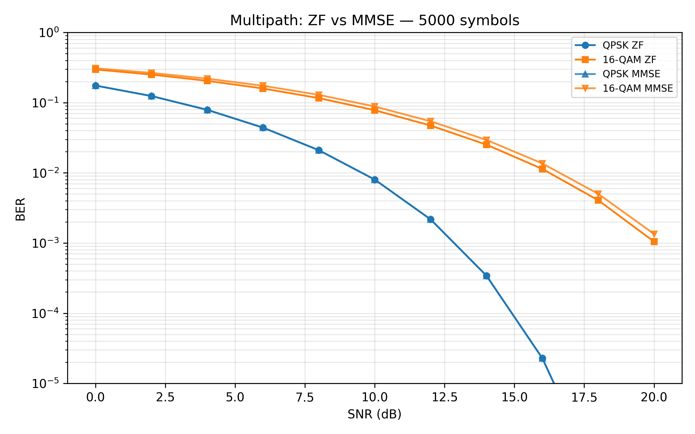

# OFDM-Simulator-Python

**End-to-End OFDM PHY-Layer Simulation in Python (QPSK & 16-QAM)** — evolving into an **RF validation-style test flow** (impairments → metrics → PASS/FAIL).

OFDM baseband transceiver: theoretical BER (AWGN), Monte Carlo BER vs SNR, QPSK and 16-QAM, AWGN and multipath channels, ZF/MMSE equalization, EVM (Error Vector Magnitude), pilot subcarriers for channel estimation, unit tests.

**Validation platform:** YAML requirements, CFO impairment, **test matrix + CSV** (limits/margins), **average power** metrics, smoke run, **`docs/TEST_PLAN.md`**. Overview: **`docs/VALIDATION_OVERVIEW.md`**.

---

## Quick Start

**Windows (use `py`):**

```powershell
git clone https://github.com/or-azarkman/OFDM-Simulator-Python.git
cd OFDM-Simulator-Python

py -m pip install -r requirements.txt

py run_simulation.py

py run_simulation.py --symbols 500 --trials 20
py run_simulation.py --channel multipath
py run_simulation.py --channel multipath --equalize mmse
py run_simulation.py --channel multipath --equalize none --symbols 5000   # for full comparison table

# Comparison outputs (after simulations)
py simulations/plot_ber_comparison.py
py simulations/plot_constellation_comparison.py
py simulations/plot_evm_comparison.py
py simulations/plot_pilots_comparison.py  # Known channel vs Pilot-based estimation

# EVM/BER vs CP length (LinkedIn-style plot)
py run_cp_sweep.py
py run_cp_sweep.py --snr 12 --trials 40 --cp 0 2 4 8 12 16 24

# Run tests
py -m pytest tests/ -v

# RF validation smoke (PASS/FAIL vs thresholds in YAML; writes JSON under results/validation/)
py simulations/validation_runs/run_validation_smoke.py
py simulations/validation_runs/run_validation_smoke.py --config configs/validation/default_smoke.yaml

# Validation matrix (multiple cases → CSV + summary JSON; exit 0 only if all cases PASS)
py simulations/validation_runs/run_validation_matrix.py
py simulations/validation_runs/run_validation_matrix.py --config configs/validation/test_matrix_default.yaml
```

**Linux/macOS** (if `python` or `python3` is in PATH): use `pip install -r requirements.txt`, `python run_simulation.py`, `pytest tests/ -v`.

From the project root: run `run_simulation.py`.

Results: `results/<N>_symbols/` (AWGN), `results/<N>_symbols_multipath_zf/`, `_mmse/`, `_zf_pilots/`, `_mmse_pilots/` (multipath); each has `images/` and CSV (BER + EVM). **Summary outputs** (organized by metric): `results/summary/ber/`, `evm/`, `constellation/`, `pilots/`, `docs/`. **Run guide (commands and full checklist):** `docs/complete_run_guide.md`.

**Sample result (BER: ZF vs MMSE, multipath):**



More plots: `results/summary/ber/`, `evm/`, `constellation/`, `pilots/`. Block diagram: `docs/images/ofdm_block_diagram.png`.

---

## Overview

This project implements a complete **OFDM (Orthogonal Frequency Division Multiplexing) baseband transceiver simulation** in Python, covering:

- **Transmitter:** Bit generation → QPSK/16-QAM (Gray) → pilot insertion → subcarrier mapping → IFFT → cyclic prefix
- **Channel:** AWGN or multipath (FIR taps + AWGN). Multipath: circular convolution then AWGN; Y_k = H_k·X_k + N_k in frequency.
- **Receiver:** CP removal (or use channel output for multipath) → FFT → channel estimation from pilots (LS) → one-tap equalization (ZF or MMSE when multipath) → demodulation → BER
- **Validation (PHY):** Theoretical BER (AWGN); simulated BER, EVM, and constellation for AWGN and multipath; CIR/CFR plots for multipath
- **Validation (RF test flow):** Configurable thresholds (`configs/validation/`), impairment models under `src/rf_impairments/`, measurements under `src/measurements/`, PASS/FAIL under `src/validation/`. Smoke runner: `simulations/validation_runs/run_validation_smoke.py`. Overview: **`docs/VALIDATION_OVERVIEW.md`**.

Supported modulation: **QPSK**, **16-QAM (Gray-coded)**.

---

## Why OFDM?

OFDM is the foundation of modern wireless PHY layers:

| Standard   | Use of OFDM        |
|-----------|--------------------|
| Wi-Fi     | IEEE 802.11 a/g/n/ac/ax |
| LTE / 5G  | Downlink / uplink  |
| DVB-T     | Digital TV         |

By splitting bandwidth into orthogonal subcarriers and using **IFFT/FFT**, OFDM achieves high spectral efficiency and robustness to multipath. This project demonstrates the full chain at **complex baseband** (no RF); all processing is baseband-only, with no RF front-end or SDR.

---

## Project Structure

```
OFDM-Simulator-Python/
├── src/
│   ├── transmitter.py
│   ├── receiver.py
│   ├── channel.py          # AWGN + multipath
│   ├── theory.py
│   ├── equalizers.py       # ZF, MMSE one-tap
│   ├── evm.py              # Error Vector Magnitude
│   ├── pilots.py           # Pilot subcarriers & channel estimation
│   ├── rf_impairments/     # Baseband RF impairment models (e.g. CFO)
│   ├── measurements/       # Metrics API for validation runs
│   └── validation/         # Thresholds, PASS/FAIL, YAML loading
├── configs/
│   └── validation/         # YAML specs: smoke + test matrix
├── simulations/
│   ├── config.py
│   ├── run_ber_and_constellation.py
│   ├── validation_runs/    # run_validation_smoke.py, run_validation_matrix.py
│   ├── plot_ber_comparison.py      # BER plots + comparison table
│   ├── plot_constellation_comparison.py  # 4×3 constellation grid
│   ├── plot_evm_comparison.py      # EVM plots + comparison table
│   └── plot_pilots_comparison.py   # Pilot-based channel estimation comparison
├── tests/
│   ├── test_transmitter.py
│   ├── test_receiver.py
│   ├── test_channel.py
│   ├── test_theory.py
│   ├── test_equalizers.py
│   ├── test_evm.py
│   └── test_pilots.py
├── results/
│   ├── <N>_symbols/                 # AWGN
│   ├── <N>_symbols_multipath/       # multipath, no equalizer
│   ├── <N>_symbols_multipath_zf/
│   ├── <N>_symbols_multipath_mmse/
│   ├── <N>_symbols_multipath_zf_pilots/    # multipath with pilots (ZF)
│   ├── <N>_symbols_multipath_mmse_pilots/  # multipath with pilots (MMSE)
│   └── summary/                     # comparison table, BER plots, constellation grid, pilot comparison
├── docs/                            # complete_run_guide.md, ofdm_overview.md, VALIDATION_OVERVIEW.md, TEST_PLAN.md, …
├── requirements.txt
└── README.md
```

---

## Configuration & Reproducibility

Simulation parameters are centralized in `simulations/config.py`:

| Parameter            | Default          | Description                            |
|----------------------|------------------|----------------------------------------|
| `fft_size`           | 64               | Number of subcarriers                  |
| `cp_len`             | 16               | Cyclic prefix length                   |
| `num_symbols`        | 5000             | OFDM symbols per run                   |
| `monte_carlo_trials` | 50               | Trials per SNR point                   |
| `snr_range_db`       | 0–20, step 2     | SNR sweep (dB)                         |
| `random_seed`        | 42               | Reproducible runs                      |
| `channel_type`       | "awgn"           | "awgn" or "multipath"                  |
| `equalize`           | "zf"             | "none", "zf", or "mmse" (for multipath)|
| `multipath_taps`     | [1,0,0.4·e^j0.5] | FIR taps (multipath only)              |

Results: `results/<N>_symbols/` (AWGN), `results/<N>_symbols_multipath_zf/` or `_multipath_mmse/` (multipath); each has CSV and `images/`. Example: `run_simulation.py --symbols 500 --channel multipath --equalize zf`.

---

## Simulation Results

- **BER vs SNR:** Simulated (Monte Carlo) and **theoretical** curves for QPSK and 16-QAM. Close match validates the implementation.
- **EVM vs SNR:** Error Vector Magnitude (%) per scenario; CSV in each run directory; comparison plots and table in `results/summary/`. Generated by the same run as BER; summary by `plot_evm_comparison.py`.
- **Constellation diagrams** at 0, 10, 20 dB for both modulations.
- **Channel estimation accuracy** (pilots): True H vs Estimated H plots (magnitude, phase, MSE per subcarrier, error distribution). Generated by `plot_pilots_comparison.py`.
- **Pilot-based comparison:** BER/EVM comparison plots (known channel vs pilot-based estimation), constellation comparison. Demonstrates the impact of channel estimation errors on system performance.
- **CSV:** `ber_vs_snr_<N>symbols_*.csv` and `evm_vs_snr_<N>symbols_*.csv` in each run directory.
- **Comparison table:** `results/summary/ber/comparison_table.csv` (BER), `results/summary/evm/evm_comparison_table.csv` (EVM); plus `.md` and `.txt` variants. BER/EVM per SNR for AWGN, Multipath (no eq), ZF, MMSE. Generated by `plot_ber_comparison.py` and `plot_evm_comparison.py`.
- **Constellation comparison:** `results/summary/constellation/constellation_comparison_*.png` — 4 columns (AWGN, Multipath no eq, ZF, MMSE) × 3 rows (0, 10, 20 dB). Generated by `plot_constellation_comparison.py`.

### Key Observations

- **QPSK:** Lower BER at a given SNR; better noise robustness, lower spectral efficiency. Wider decision regions make it more tolerant to channel and estimation errors.
- **16-QAM:** Higher throughput (4 bits/symbol) but needs higher SNR for similar BER. Tighter constellation spacing increases sensitivity to EVM and channel estimation errors.
- **Theoretical vs simulated (AWGN):** Agreement confirms correct modulation, channel scaling, and BER computation.
- **Multipath:** Circular convolution + one-tap ZF or MMSE equalization; BER decreases with SNR. Without equalization, multipath gives a high BER floor.
- **Pilot-based channel estimation:** LS estimation from pilots degrades performance compared to perfect channel knowledge, especially at low SNR. At high SNR (≥18 dB), pilot-based estimation approaches known-channel performance. Channel estimation accuracy plots show interpolation errors between pilot positions, demonstrating realistic system behavior.

**Modulation and EVM:** When BER or EVM is too high for the target link budget or standard (e.g. 3GPP/Wi‑Fi EVM limits), the system designer typically **steps down to a lower-order modulation** (e.g. 64‑QAM → 16‑QAM → QPSK). Lower-order modulations have **wider decision regions** and fewer constellation points, so they tolerate more noise and channel/estimation error while meeting EVM and BER requirements—at the cost of spectral efficiency. This trade-off is especially important for **high-order QAM (64‑QAM, 256‑QAM)** in precision applications, where EVM margins are tight and channel estimation errors have a larger impact.

---

## Key concepts

Baseband chain: bits → modulation → pilot insertion → IFFT → CP; receiver: CP removal → FFT → channel estimation from pilots (LS) → ZF/MMSE equalization (multipath) → demod → BER. EVM measures received vs transmitted symbol deviation (%). CP enables circular convolution and one-tap equalization. Pilots enable channel estimation in frequency-selective channels. Gray coding; theoretical BER (AWGN). Tests: transmitter, receiver, channel, theory, equalizers, evm, pilots. For lessons learned and next-phase roadmap, see `docs/lessons_learned.md` and `docs/next_phase_plan.md`.

---

## Tools & Technologies

- **Python 3.9+**
- **NumPy** — arrays, FFT/IFFT
- **SciPy** — `erfc` for theoretical BER
- **Matplotlib** — BER and constellation plots
- **PyYAML** — validation config files
- **pytest** — unit tests

---

## Running Tests

From the project root:

```powershell
py -m pytest tests/ -v
py -m pytest tests/ -v --cov=src   # with coverage (requires pytest-cov)
```

On Linux/macOS: `pytest tests/ -v`. Full run/test reference: **`docs/complete_run_guide.md`**.

Tests cover: transmitter, receiver, channel (AWGN + multipath), theory, equalizers (ZF, MMSE), EVM, pilots (pattern generation, insertion, channel estimation).

---

## License

MIT License.

---

## Notes

OFDM PHY-layer simulation. Mathematical details: `docs/ofdm_overview.md`. Lessons learned, limitations, and future work: `docs/lessons_learned.md`. Next phase / roadmap: `docs/next_phase_plan.md`. **RF extensions (ordered steps):** `docs/RF_ROADMAP.md`. **RF validation:** `docs/VALIDATION_OVERVIEW.md`, **`docs/TEST_PLAN.md`**, `docs/VALIDATION_REPORT_EXAMPLE.md`. **Hebrew project status brief:** `docs/project_status_brief_hebrew.md`.
