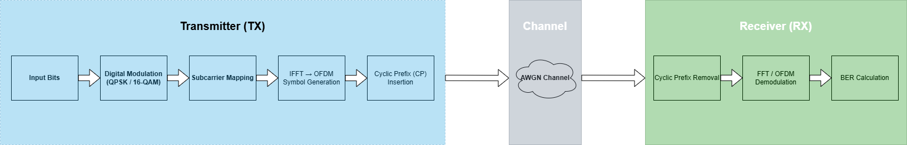

# OFDM System Overview

## Overview

Orthogonal Frequency Division Multiplexing (**OFDM**) is a multi-carrier modulation technique widely used in modern wireless communication systems such as **Wi-Fi, LTE, and 5G**. In OFDM, a high-rate serial bitstream is divided into multiple parallel low-rate streams, each transmitted over an orthogonal subcarrier. This approach improves spectral efficiency and robustness to channel impairments.

All signals in this project are modeled at the **complex baseband level**, focusing on **PHY-layer digital signal processing** rather than RF front-end implementation.

This document provides a comprehensive overview of the OFDM system, including **system architecture, signal model, modulation, receiver processing, simulation parameters, and key outputs**.

---

## System Block Diagram

**Block color coding:**
- **Blue** — Transmitter (TX)
- **Gray** — Channel (AWGN)
- **Green** — Receiver (RX)

---

## Mathematical Foundations

### OFDM Time-Domain Symbol Generation

Each OFDM symbol is generated using an **Inverse Fast Fourier Transform (IFFT)**:

$$
x[n] = \frac{1}{N} \sum_{k=0}^{N-1} X_k \cdot e^{j 2 \pi k n / N}, \quad n = 0,1,\dots,N-1
$$

Where:  
- $X_k$ = modulated symbol on subcarrier $k$ (QPSK or 16-QAM)  
- $N$ = FFT size

**Explanation:** The IFFT converts frequency-domain symbols into a time-domain waveform while preserving subcarrier orthogonality. The receiver uses FFT to recover the symbols.

---

### Cyclic Prefix (CP)

To prevent inter-symbol interference (ISI), a cyclic prefix of length $N_{CP}$ is prepended to each OFDM symbol:

$$
x_{\text{CP}}[n] = x[N - N_{CP} + n], \quad n = 0,1,\dots,N_{CP}-1
$$

$$
x_{\text{tx}}[n] = [x_{\text{CP}}[0], \dots, x_{\text{CP}}[N_{CP}-1], x[0], \dots, x[N-1]]
$$

**Explanation:** The CP converts linear convolution with the channel into circular convolution, preserving subcarrier orthogonality and simplifying frequency-domain equalization.

---

## Modulation Schemes

### QPSK

Quadrature Phase Shift Keying maps 2 bits per symbol into a complex constellation point:

$$
s = \frac{1}{\sqrt{2}} \Big( (2b_0 - 1) + j(2b_1 - 1) \Big)
$$

- Unit average symbol energy  
- Gray coding is used to minimize bit errors

### 16-QAM

16-Quadrature Amplitude Modulation maps 4 bits per symbol:

$$
s = \frac{1}{\sqrt{10}} \Big( (2b_0 + b_1 - 1.5) + j(2b_2 + b_3 - 1.5) \Big)
$$

- Gray coding used to minimize bit errors  
- Average symbol power normalized to match QPSK

---

## Receiver Processing

1. **Cyclic Prefix Removal** – remove the CP from each OFDM symbol  
2. **FFT** – recover frequency-domain subcarrier symbols  
3. **Demodulation** – according to the selected modulation (QPSK / 16-QAM)  
4. **BER Calculation** – compare received bits with transmitted bits

---

## Simulation Parameters

| Parameter               | Value           | Notes                                   |
|-------------------------|----------------|-----------------------------------------|
| FFT size                | 64             | Number of subcarriers                   |
| Cyclic Prefix length    | 16             | 25% of FFT size                         |
| Modulation schemes      | QPSK / 16-QAM  | Gray-coded                              |
| OFDM symbols per run    | 500 / 5000     | Performance comparison                  |
| Monte-Carlo trials      | 50             | BER averaging                            |
| SNR range               | 0–20 dB        | Step of 2 dB                             |

---

## Simulation Scope

### Included
- Random bitstream generation  
- QPSK and 16-QAM modulation  
- OFDM modulation/demodulation (IFFT/FFT)  
- Cyclic prefix insertion/removal  
- AWGN channel  
- BER computation  
- Constellation and BER plots

### Not Included
- Synchronization (CFO, timing offset)  
- Multipath fading channels  
- Channel estimation / equalization  
- FEC or RF/SDR implementation

**Channel Model:**  
Additive White Gaussian Noise (AWGN) is added to the transmitted complex baseband signal based on the specified SNR.

---

## Key Outputs

- Constellation diagrams at selected SNRs  
- BER vs SNR performance curves  
- CSV files containing averaged BER results for 500 and 5000 symbols  

---

## Future Extensions

- Frequency-selective multipath channels  
- Channel estimation and equalization  
- Carrier Frequency Offset (CFO) and timing offset modeling  
- Higher-order modulation schemes (64-QAM, 256-QAM)  
- Optional SDR-based real-time implementation  

---

## Summary

This document describes the **system-level architecture, mathematical foundations, and simulation boundaries** of the OFDM PHY-layer project.  
It serves as a reference for Python module implementation and simulation experiments, forming a baseline for future extensions.
