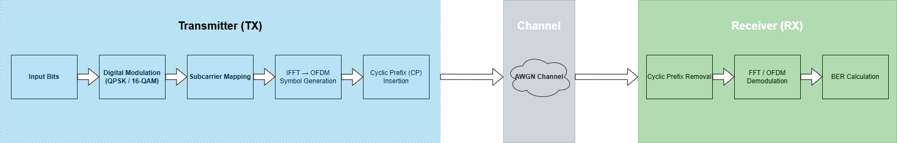

# OFDM System Overview

## Overview

Orthogonal Frequency Division Multiplexing (**OFDM**) is a multi-carrier modulation technique widely used in modern wireless communication systems such as **Wi-Fi, LTE, and 5G**. In OFDM, a high-rate serial bitstream is divided into multiple parallel low-rate streams, each transmitted over an orthogonal subcarrier. This approach improves spectral efficiency and robustness to channel impairments.

All signals in this project are modeled at the **complex baseband level**, focusing on **PHY-layer digital signal processing** rather than RF front-end implementation.

This document provides a comprehensive overview of the OFDM system, including **system architecture, signal model, modulation, receiver processing, simulation parameters, and key outputs**.

---

## System Block Diagram

**Block color coding:**
- **Blue** — Transmitter (TX)
- **Gray** — Channel (AWGN / multipath)
- **Green** — Receiver (RX)

---

## Mathematical Foundations

### OFDM Time-Domain Symbol Generation

Each OFDM symbol is generated using an **Inverse Fast Fourier Transform (IFFT)**:

$$
x[n] = \frac{1}{N} \sum_{k=0}^{N-1} X_k \cdot e^{j 2 \pi k n / N}, \quad n = 0,1,\dots,N-1
$$

Where:  
- $$X_k$$ = modulated symbol on subcarrier $$k$$ (QPSK or 16-QAM)  
- $$N$$ = FFT size

**Explanation:** The IFFT converts frequency-domain symbols into a time-domain waveform while preserving subcarrier orthogonality. The receiver uses FFT to recover the symbols.

---

### Cyclic Prefix (CP)

To prevent inter-symbol interference (ISI), a cyclic prefix of length $$N_{CP}$$ is prepended to each OFDM symbol:

$$
x_{\text{CP}}[n] = x[N - N_{CP} + n], \quad n = 0,1,\dots,N_{CP}-1
$$

$$
x_{\text{tx}}[n] = [x_{\text{CP}}[0], \dots, x_{\text{CP}}[N_{CP}-1], x[0], \dots, x[N-1]]
$$

**Explanation:** The CP converts linear convolution with the channel into circular convolution, preserving subcarrier orthogonality and simplifying frequency-domain equalization.

---

## Modulation Schemes

### QPSK

Quadrature Phase Shift Keying maps 2 bits per symbol into a complex constellation point:

$$
s = \frac{1}{\sqrt{2}} \Big( (2b_0 - 1) + j(2b_1 - 1) \Big)
$$

- Unit average symbol energy  
- Gray coding is used to minimize bit errors

### 16-QAM

16-Quadrature Amplitude Modulation maps 4 bits per symbol:

$$
s = \frac{1}{\sqrt{10}} \Big( (2b_0 + b_1 - 1.5) + j(2b_2 + b_3 - 1.5) \Big)
$$

- Gray coding used to minimize bit errors  
- Average symbol power normalized to match QPSK

---

### Modulation choice and EVM / BER trade-off

The choice of modulation order is a **trade-off between spectral efficiency and robustness**:

| Modulation | Bits/symbol | Decision-region size | Typical use |
|------------|-------------|----------------------|-------------|
| QPSK       | 2           | Largest (4 points)   | Low SNR, robust links |
| 16-QAM     | 4           | Medium (16 points)  | Balanced throughput vs. robustness |
| 64-QAM     | 6           | Small (64 points)    | High SNR, high throughput |
| 256-QAM    | 8           | Smallest (256 points)| Very high SNR, precision required |

**When BER or EVM is too high** (e.g. above link-budget or standard limits such as 3GPP/Wi‑Fi EVM masks), the standard practice is to **step down to a lower-order modulation**. Lower-order modulations provide **wider, clearer decision regions**: fewer constellation points and larger spacing reduce sensitivity to noise, channel distortion, and channel-estimation errors. As a result, EVM and BER improve at the cost of lower bits per symbol. This is especially relevant for **64‑QAM and 256‑QAM** in precision applications (e.g. high-order MCS in 5G/Wi‑Fi 6), where EVM margins are tight and estimation errors have a strong impact. The simulator’s QPSK vs. 16‑QAM comparison illustrates this principle; extending to 64‑QAM would show the same trend with even tighter EVM requirements.

---

## Receiver Processing

1. **Cyclic Prefix Removal** – remove the CP from each OFDM symbol (for AWGN); for multipath the channel output is already the useful part without CP.  
2. **FFT** – recover frequency-domain subcarrier symbols $$Y_k$$.  
3. **Channel Estimation (when pilots enabled)** – extract received pilots $$Y_p$$, estimate channel $$\hat{H}_k$$ using Least Squares (LS) at pilot positions, then interpolate to all subcarriers:
   $$\hat{H}_p = \frac{Y_p}{X_p}$$
4. **Equalization (multipath only)** – one-tap ZF or MMSE using estimated channel $$\hat{H}_k$$ (from pilots) or true channel $$H_k$$ (when pilots disabled):
   $$\hat{X}_k^{\text{ZF}} = \frac{Y_k}{\hat{H}_k}, \qquad W_k^{\text{MMSE}} = \frac{\hat{H}_k^*}{|\hat{H}_k|^2 + 1/\mathrm{SNR}}$$  
5. **Demodulation** – according to the selected modulation (QPSK / 16-QAM).  
6. **BER Calculation** – compare received bits with transmitted bits.

---

## Channel Models

**AWGN:** Additive White Gaussian Noise; noise power set from SNR (Es/N0). Used as baseline.

**Multipath (frequency-selective):** FIR impulse response $$h[n]$$ (taps) plus AWGN. Per OFDM symbol we apply **circular convolution** of the useful part (after CP) with the taps, then AWGN; in frequency domain $$Y_k = H_k X_k + N_k$$. The receiver can use **no equalization** (for baseline comparison), **one-tap ZF** ($$Y_k / H_k$$), or **one-tap MMSE** ($$W_k = H^*_k / (|H_k|^2 + 1/\mathrm{SNR})$$). Taps normalized to unit energy; default taps: $$[1, 0, 0.4 e^{j0.5}]$$. Outputs: CIR and CFR plots.

---

### Pilot Subcarriers and Channel Estimation

**Pilot subcarriers** are known symbols inserted at specific subcarrier positions to enable channel estimation at the receiver. In frequency-selective channels, the receiver must estimate the channel frequency response $$H_k$$ to perform equalization.

**Pilot Pattern:** Pilots are evenly spaced across the frequency grid (e.g., every 8th subcarrier for FFT size 64). The pattern is configurable via `pilot_spacing` or `num_pilots` in the simulation config.

**Channel Estimation:** Least Squares (LS) estimation is performed at pilot positions:

$$
\hat{H}_p = \frac{Y_p}{X_p}
$$

where $$Y_p$$ are received pilot symbols and $$X_p$$ are known transmitted pilot symbols. The channel estimate is then interpolated to all subcarriers (linear interpolation by default). The estimated channel $$\hat{H}_k$$ is used in ZF/MMSE equalization instead of the true channel $$H_k$$.

**Implementation:** Pilots are inserted in the transmitter (`src/pilots.py`, `src/transmitter.py`), extracted at the receiver, and used for channel estimation. When pilots are disabled, the receiver uses the true channel (for comparison or AWGN scenarios).

**Performance Impact:** Channel estimation errors from pilots introduce additional noise in the equalization process. At high SNR, the estimation error is small and performance approaches that of a known channel. At low SNR, estimation errors degrade BER and EVM compared to perfect channel knowledge. The degradation depends on the number of pilots (more pilots → better estimation but lower data rate) and the interpolation method. The comparison plots (`plot_pilots_comparison.py`) demonstrate this trade-off.

---

### Error Vector Magnitude (EVM)

**EVM** measures the deviation of received (equalized) constellation points from the transmitted reference, normalized by the reference power:

$$
\mathrm{EVM}_{\mathrm{RMS}} = \sqrt{ \frac{\mathbb{E}[|R_k - X_k|^2]}{\mathbb{E}[|X_k|^2]} }
$$

where $$R_k$$ are the received (equalized) frequency-domain symbols and $$X_k$$ the transmitted symbols. The result is reported as a percentage (100 × EVM_RMS). Lower EVM indicates better modulation accuracy; it complements BER by characterizing symbol-level error before hard decision.

---

## Simulation Parameters

|       Parameter         |     Value       |              Notes                      |
|-------------------------|-----------------|-----------------------------------------|
| FFT size                | 64              | Number of subcarriers                   |
| Cyclic Prefix length    | 16              | 25% of FFT size                         |
| Modulation schemes      | QPSK / 16-QAM   | Gray-coded                              |
| OFDM symbols per run    | 500 / 5000      | Performance comparison                  |
| Monte-Carlo trials      | 50              | BER averaging                           |
| SNR range               | 0–20 dB         | Step of 2 dB                            |
| Channel                 | AWGN / multipath| Selectable via config or `--channel`    |
| Pilots                  | Optional (implemented) | `use_pilots`; `pilot_spacing` or `num_pilots`; LS channel estimation |

---

## Simulation Scope

### Included
- Random bitstream generation; QPSK and 16-QAM (Gray); OFDM IFFT/FFT; cyclic prefix
- AWGN and multipath (circular convolution + AWGN); multipath with **no equalizer**, **ZF**, or **MMSE** (`--equalize none|zf|mmse`)
- **Pilot-based channel estimation** (`--pilots`): Pilot subcarrier insertion, LS channel estimation, interpolation
- BER and **EVM (Error Vector Magnitude)** computation; constellation, BER vs SNR, and EVM vs SNR plots; CIR and CFR plots for multipath
- Theoretical BER curves (AWGN); CSV results per run (BER + EVM)
- **Comparison outputs:** BER and EVM tables (by scenario per SNR), BER and EVM comparison plots, constellation comparison grid (4×3), pilot-based channel estimation comparison plots

### Not Included
- Synchronization (CFO, timing offset); blind channel estimation (pilot-based estimation is implemented); FEC; RF/SDR

---

## Key Outputs

- **Per-run:** Constellation diagrams at 0, 10, 20 dB (AWGN and multipath); BER vs SNR and EVM vs SNR curves (simulated; theoretical BER for AWGN); CIR and CFR plots for multipath; CSV: BER and EVM vs SNR per modulation.
- **Summary (after running comparison scripts):** BER table and plots in `results/summary/ber/`; EVM table and plots in `results/summary/evm/`; constellation comparison in `results/summary/constellation/`; pilot-based comparison in `results/summary/pilots/`. Generated by `plot_ber_comparison.py`, `plot_evm_comparison.py`, `plot_constellation_comparison.py`, and `plot_pilots_comparison.py`. Commands: `docs/RUN_AND_TEST.md`.
- **Pilot-based channel estimation:** Channel estimation accuracy plots (true H vs estimated H, MSE per subcarrier); BER/EVM comparison (known channel vs pilot-based); constellation comparison. Generated by `plot_pilots_comparison.py`. Demonstrates the performance impact of channel estimation errors.
- **Complete guide:** See `docs/COMPLETE_RUN_GUIDE.md` for a comprehensive checklist of all simulations and plots.

---

## Future Extensions

- CFO and timing offset; higher-order modulation (64-QAM); FEC; SDR. EVM and pilot-based channel estimation are implemented. See `docs/LESSONS_LEARNED.md` and `docs/NEXT_PHASE_PLAN.md` for the roadmap.

---

## Summary

This document describes the **system-level architecture, mathematical foundations, and simulation boundaries** of the OFDM PHY-layer project.  
It serves as a reference for Python module implementation and simulation experiments, forming a baseline for future extensions.
